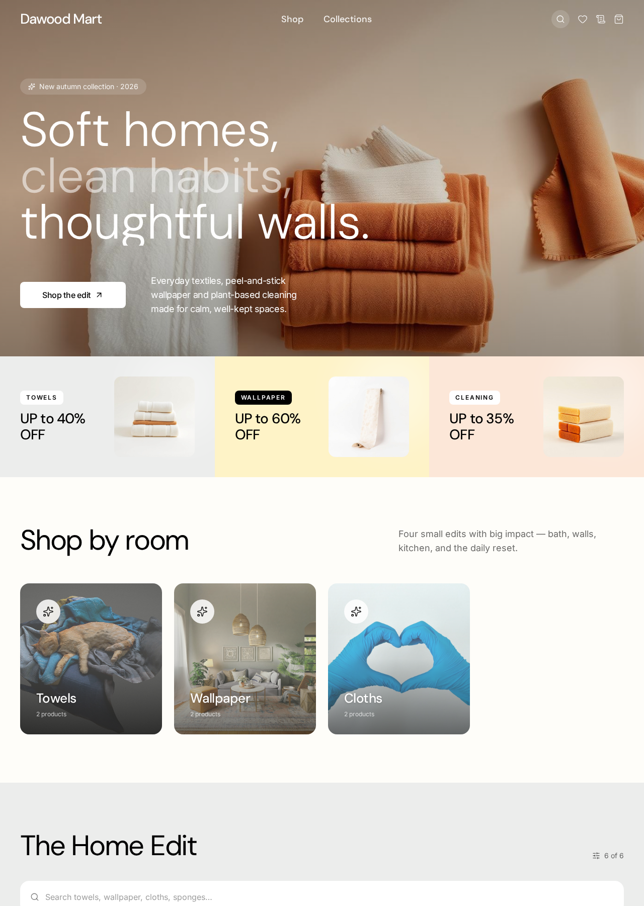
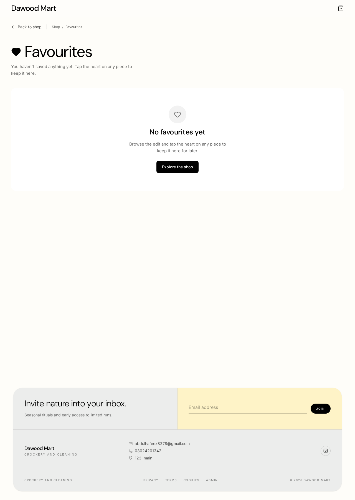
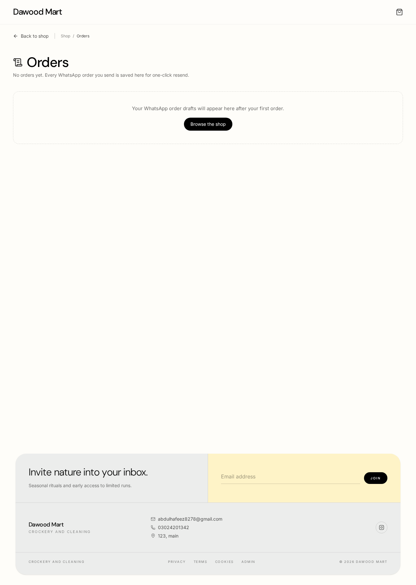
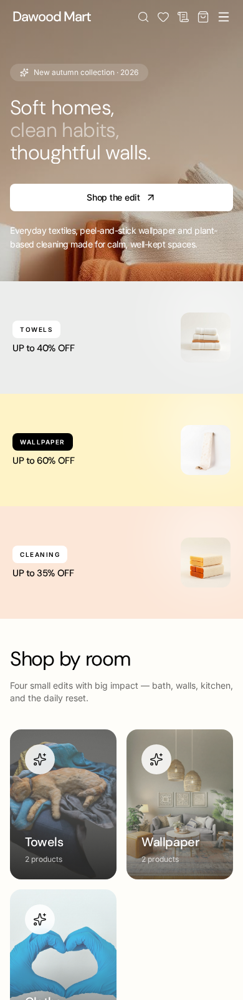

<div align="center">

# 🛍️ Dawood Mart

**A modern, editorial-style e-commerce storefront for Pakistani home essentials — with a full admin control panel and WhatsApp-powered checkout.**

Built on TanStack Start · React 19 · Tailwind CSS v4 · Supabase



</div>

---

## ✨ Highlights

- 🏠 **Editorial storefront** — hero, category cards, promotional rows and a filterable product grid
- 🛒 **Slide-in cart drawer** with variants, quantity toasts, undo, and localStorage persistence
- ❤️ **Favorites** — save products, sync across tabs, dedicated Favorites page
- 💬 **WhatsApp checkout** — no payment gateway required; customers order directly via a pre‑filled WhatsApp message with items, sizes, colors, quantities and totals
- 🗂️ **Saved orders history** — resend past orders in one click
- 🔐 **Admin dashboard** — Products, Categories, Promotions, Orders and Settings CRUD with image upload, cropping, CSV import/export, bulk actions and RLS-protected writes
- 📱 **Fully responsive** — audited across mobile, tablet and desktop
- 🇵🇰 **Localised for Pakistan** — PKR currency and `0301-1234567` phone formatting

---

## 📸 Screenshots

### Storefront


### Favorites


### Saved Orders


### Admin login


### Mobile


---

## 🧭 User Flow

```
                ┌──────────────────────────┐
                │        Home /             │
                │ Hero · Categories · Grid  │
                └────────────┬──────────────┘
                             │
              ┌──────────────┼──────────────┐
              ▼              ▼              ▼
      /product/:id     Favorites ❤       Search 🔍
     (size + color +   /favorites        (inline)
      qty stepper)          │
              │             │
              └──────┬──────┘
                     ▼
              🛒 Cart Drawer
              (variants, qty, undo)
                     │
                     ▼
        💬 Order on WhatsApp
        (pre-filled message)
                     │
                     ▼
            /orders (history + resend)
```

**Admin flow**: `/admin/login` → `/admin` → Products · Categories · Promotions · Orders · Settings.

---

## 🧱 Tech Stack

| Layer      | Choice |
|------------|--------|
| Framework  | [TanStack Start](https://tanstack.com/start) v1 (SSR + server functions) |
| UI         | React 19, Tailwind CSS v4, shadcn/ui, Radix Primitives |
| Data       | Supabase (Postgres + Auth + Storage) with RLS |
| State      | TanStack Query, local hooks + `localStorage` mirror |
| Forms      | React Hook Form + Zod |
| Media      | `react-easy-crop` for promo/product image cropping |
| Toasts     | `sonner` |
| Build      | Vite 7, TypeScript strict |

---

## 🗂️ Project Structure

```
src/
├── routes/                    # File-based routing (TanStack Start)
│   ├── __root.tsx             # App shell + error / 404 boundaries
│   ├── index.tsx              # Storefront (hero, categories, promos, grid)
│   ├── product.$id.tsx        # Product detail with variants
│   ├── favorites.tsx          # Saved items
│   ├── orders.tsx             # WhatsApp order history
│   ├── admin.login.tsx        # Admin sign-in
│   └── admin.index.tsx        # Dashboard: CRUD tabs
├── components/
│   ├── ProductCard.tsx        # Memoized card with swatches + sizes
│   ├── CartDrawer.tsx         # Slide-in cart
│   ├── SiteFooter.tsx         # Editorial footer
│   └── admin/…                # PromotionsPanel, image uploaders, etc.
├── lib/
│   ├── shop.ts                # Products, categories, cart, favorites
│   ├── settings.ts            # Brand + contact settings
│   ├── whatsapp.ts            # Pre-filled order message builder
│   ├── orders.ts              # Saved order history
│   ├── storage.ts             # Supabase Storage upload w/ progress
│   ├── format.ts              # PKR formatting
│   └── pk-phone.ts            # PK phone formatter + validator
└── integrations/supabase/     # Auto-generated client
```

---

## 🚀 Getting Started

```bash
bun install     # or npm install
bun run dev     # http://localhost:8080
```

The project is pre-wired to Lovable Cloud (Supabase). Env vars live in `.env`.

### Database

Run `db/schema.sql` in your Supabase project to create `products`, `categories`, `promotions`, `orders`, `user_roles` and the `has_role()` security definer. All public tables are RLS-protected; writes require the `admin` role.

### Grant admin

```sql
insert into public.user_roles (user_id, role)
values ('<your-user-uuid>', 'admin');
```

---

## 🛡️ Security Model

- **RLS on every public table** with policies scoped by `has_role(auth.uid(), 'admin')`
- Roles stored in a **dedicated `user_roles` table** (never on profiles) to prevent privilege escalation
- Product & promotion images uploaded to a **`product-images` Supabase Storage bucket** with public read + admin write
- Client-side admin routes are gated by session + role check; server functions re-verify via `requireSupabaseAuth`

---

## 💬 WhatsApp Checkout

Instead of a payment gateway, "Order on WhatsApp" builds a live message from the current cart:

```
🛍️ *New order — Dawood Mart*

1. Turkish Cotton Towel
   Size: L · Color: Sand · Qty: 2
   PKR 5,800

——————————————
Subtotal: PKR 11,600
Shipping: Free (over PKR 5,000)
*Total: PKR 11,600*
```

The message is regenerated at click time so totals always match the cart, and every send is saved to `/orders` for one-click resend.

---

## 🧪 Scripts

| Command | What it does |
|---------|--------------|
| `bun run dev` | Start Vite dev server |
| `bun run build` | Production build |
| `bun run build:dev` | Dev-mode build (SSR prerender check) |
| `bun run lint` | ESLint |
| `bun run format` | Prettier |

---

<div align="center">

Made with ☕ in Pakistan · Built on [Lovable](https://lovable.dev)

</div>
